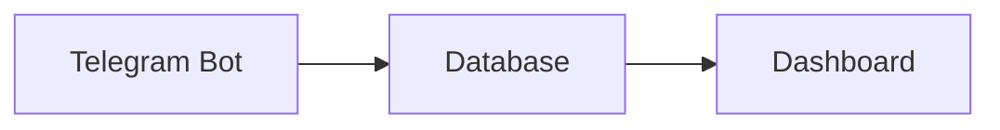

# 📚 Документация Финансового Бота

## 📋 Обзор

Эта папка содержит полную документацию по финансовому боту, оптимизированную для использования в Obsidian. Документация структурирована для удобной навигации и содержит всю необходимую информацию для разработки, поддержки и расширения проекта.

## 🗂️ Структура документации

```
docs/
├── 📄 README.md                   # Этот файл - описание документации
├── 🏠 index.md                    # Главная страница и навигация
├── 🤖 telegram-bot.md             # Документация Telegram бота
├── 🗄️ database.md                  # Документация базы данных
├── 📊 streamlit-dashboard.md      # Документация дашборда
├── 💡 ideas-and-improvements.md   # Идеи и планы развития
└── 🐛 troubleshooting.md           # Траблшутинг и решения
```

## 🎯 Как использовать документацию

### 🔗 Быстрые ссылки

- [[🏠 Главная страница|index.md]] - Начните отсюда
- [[🤖 Telegram Бот|telegram-bot.md]] - Основной компонент
- [[📊 Streamlit Дашборд|streamlit-dashboard.md]] - Визуализация данных
- [[🗄️ База Данных|database.md]] - Модель данных
- [[💡 Идеи|ideas-and-improvements.md]] - Планы развития

### 🚱 Obsidian Интеграция

Документация оптимизирована для Obsidian со следующими возможностями:

#### 🔗 Wiki-ссылки
- Все страницы связаны между собой
- Быстрая навигация по компонентам
- Контекстные переходы

#### 🏷️ Теги
- `#telegram-bot` - связанные с ботом
- `#database` - работа с базой данных
- `#streamlit` - дашборд и визуализация
- `#python` - Python код
- `#async` - асинхронное программирование
- `#finance` - финансовая логика

#### 📊 Графы связей
В Obsidian вы можете видеть граф связей между компонентами:

```
Telegram Bot ←→ Database ←→ Streamlit Dashboard
     ↓              ↓              ↓
   Ideas ←→ Troubleshooting ←→ API (Future)
```

## 📖 Чтение по порядку

### 🚀 Для начала работы
1. [[🏠 index.md]] - Обзор проекта и навигация
2. [[🤖 telegram-bot.md]] - Как работает бот
3. [[🗄️ database.md]] - Как хранятся данные

### 🔧 Для разработки
1. [[🤖 telegram-bot.md]] - Архитектура бота
2. [[🗄️ database.md]] - Модель данных
3. [[📊 streamlit-dashboard.md]] - Визуализация
4. [[🐛 troubleshooting.md]] - Решение проблем

### 💡 Для улучшения
1. [[💡 ideas-and-improvements.md]] - План развития
2. [[📊 streamlit-dashboard.md]] - UI/UX идеи
3. [[🤖 telegram-bot.md]] - Новые функции

## 🛠️ Работа с документацией

### 📝 Редактирование
- Все файлы в формате Markdown
- Поддержка MathJax для формул
- Код с подсветкой синтаксиса
- Встраивание изображений и диаграмм

### 🔄 Актуализация
- Регулярно обновляйте при изменении кода
- Добавляйте новые идеи в `ideas-and-improvements.md`
- Фиксируйте проблемы в `troubleshooting.md`

### 📱 Доступ
- **Obsidian** - лучший опыт с графами связей
- **VS Code** - с Markdown Preview
- **Любой Markdown редактор** - базовый функционал
- **Браузер** - GitHub Pages рендеринг

## 🎨 Особенности документации

### 📋 Структура страниц

Каждая страница включает:
- 📋 **Обзор** - краткое описание компонента
- 🏗️ **Архитектура** - структура и зависимости
- 🎯 **Функциональность** - возможности и особенности
- 💻 **Кодовые примеры** - практические примеры
- 🔗 **Интеграции** - связи с другими компонентами
- 💡 **Идеи** - предложения по улучшению

### 🏷️ Соглашения по разметке

#### Заголовки
```markdown
# 🎯 Основной заголовок
## 📋 Раздел
### 🔄 Подраздел
```

#### Код
```python
# Python код с подсветкой
def example():
    return "code example"
```

#### Диаграммы


#### Теги
```markdown
<!-- В конце каждой страницы -->
**Теги:** `component` `technology` `feature`
```

### 🔗 Внутренние ссылки

#### Wiki-ссылки
```markdown
[[Database]] - прямая ссылка
[[🗄️ База Данных|database.md]] - с псевдонимом
```

#### Контекстные ссылки
```markdown
Подробнее см. [[🗄️ Database]]
```

## 📊 Метаданные

### 📈 Статистика документации
- **Общий размер:** ~15KB текста
- **Количество страниц:** 6 основных страниц
- **Кодовых примеров:** 50+
- **Диаграмм:** 10+
- **Идей для улучшения:** 100+

### 🔄 Версионирование
- **Текущая версия:** 1.0.0
- **Последнее обновление:** 2024-11-16
- **Формат:** Markdown
- **Лицензия:** MIT

## 🔍 Поиск по документации

### 🔍 Темы для поиска
- `aiogram` - Telegram бот фреймворк
- `SQLAlchemy` - ORM для базы данных
- `Plotly` - библиотека графиков
- `async` - асинхронное программирование
- `database` - работа с SQLite
- `dashboard` - Streamlit приложение

### 🏷️ Популярные теги
- `#python` - Python код и практики
- `#async` - асинхронное программирование
- `#telegram-bot` - разработка ботов
- `#database` - базы данных
- `#streamlit` - веб-дешборды
- `#plotly` - визуализация
- `#finance` - финансовая логика

## 🤝 Вклад в документацию

### 📝 Как добавить информацию
1. Выберите подходящий файл
2. Добавьте раздел с соответствующим заголовком
3. Используйте установленные соглашения
4. Добавьте ссылки на связанные страницы
5. Обновите `index.md` при необходимости

### 💡 Идеи для улучшения документации
- [ ] **Видеотуториалы** - скринкасты
- [ ] **Интерактивные примеры** - runnable код
- [ ] **API Reference** - автоматически сгенерированная документация
- [ ] **Часто задаваемые вопросы** - FAQ
- [ ] **Сравнение альтернатив** - почему выбрали эти технологии

### 🔧 Инструменты для работы
- **Obsidian** - основной редактор
- **VS Code** - с расширением Markdown
- **Mermaid Live Editor** - для диаграмм
- **GitHub** - версионирование

## 📞 Обратная связь

### 🐛 Сообщить об ошибках в документации
1. Найдите ошибку или неточность
2. Создайте issue в репозитории
3. Опишите проблему подробно
4. Предложите исправление, если возможно

### 💡 Предложить улучшения
1. Добавьте идеи в `ideas-and-improvements.md`
2. Обсудите в команде
3. Реализуйте и обновите документацию

### 📧 Контакт
- **GitHub Issues:** [ссылка на репозиторий]
- **Email:** [адрес электронной почты]
- **Discord:** [ссылка на сервер]

---

**Последнее обновление:** 2024-11-16
**Версия документации:** 1.0.0
**Авторы:** Finance Bot Team

---

> 💡 **Совет:** Используйте Obsidian для максимального удобства - графики связей показывают зависимости между компонентами и помогают быстро находить нужную информацию.

> 🚀 **Начните с:** [[🏠 index.md]] для полного обзора проекта.