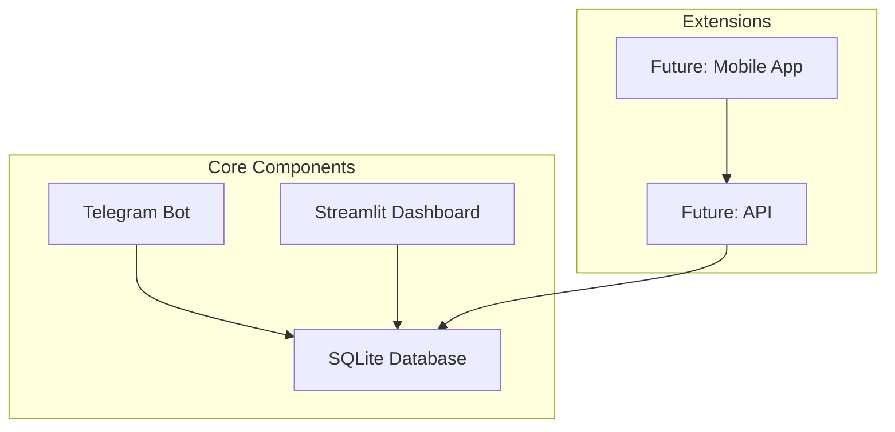

# 📚 Финансовый Бот - Документация проекта

## 🎯 Обзор проекта

Полноценная система для учета личных финансов, включающая Telegram бота для быстрого ввода данных, интерактивный дашборд для визуализации и надежную базу данных для хранения информации.

### 🏗️ Архитектура системы



## 📁 Структура проекта

```
finance_bot/
├── 📋 main.py                    # Telegram бот
├── 📊 dashboard/                 # Streamlit дашборд
│   ├── app.py                   # Основное приложение
│   ├── data_loader.py           # Загрузка данных
│   └── charts.py                # Графики
├── 🗄️ database/                  # База данных
│   ├── database.py              # SQLAlchemy модели
│   └── transaction_repository.py # Репозитории
├── ⚙️ config/                    # Конфигурация
├── 📜 src/                       # Вспомогательные модули
├── 📚 docs/                      # Документация
├── 📦 requirements.txt           # Зависимости
└── 🔧 .env                       # Переменные окружения
```

## 🚀 Быстрый старт

### 1. Установка зависимостей
```bash
pip install -r requirements.txt
```

### 2. Настройка окружения
```bash
cp .env.example .env
# Отредактировать .env с токеном бота
```

### 3. Запуск компонентов
```bash
# Telegram бот
python main.py

# Дашборд
streamlit run dashboard/app.py
```

## 📖 Документация

### 📑 Основные разделы

#### 🤖 [[Telegram Bot]]
- Архитектура и компоненты
- Обработчики команд и callback
- Inline-кнопки и UI
- Парсер сообщений
- Управление сессиями

#### 🗄️ [[Database]]
- Модель данных SQLAlchemy
- Репозитории и CRUD операции
- Аналитические запросы
- Индексы и оптимизация
- Миграции и версионирование

#### 📊 [[Streamlit Dashboard]]
- Структура приложения
- Загрузка и обработка данных
- Создание интерактивных графиков
- Кэширование и оптимизация
- UI/UX дизайн

### 🔗 Связанные страницы

#### 📋 [[Идеи и Улучшения]]
- [ ] Функциональные улучшения
- [ ] Технические улучшения
- [ ] UI/UX идеи
- [ ] Интеграции

#### 🐛 [[Траблшутинг и Решения]]
- Распространенные проблемы
- Логирование и отладка
- Производительность
- Безопасность

#### 📈 [[Аналитика и Метрики]]
- Ключевые показатели
- Анализ пользовательского поведения
- Мониторинг системы
- Отчетность

## 🎯 Ключевые возможности

### Telegram Бот
- ✅ Добавление доходов/расходов через inline-кнопки
- ✅ Редактирование и удаление транзакций
- ✅ Просмотр баланса и статистики
- ✅ История транзакций
- ✅ Интуитивный интерфейс

### Streamlit Дашборд
- ✅ Интерактивные графики доходов/расходов
- ✅ Анализ по категориям
- ✅ Временные тренды (дни/недели/месяцы)
- ✅ Топ категории
- ✅ Экспорт данных

### База данных
- ✅ SQLAlchemy ORM
- ✅ Асинхронные операции
- ✅ Индексация для производительности
- ✅ Безопасность и целостность данных

## 🛠️ Технологический стек

### Backend
- **Python 3.8+** - основной язык
- **aiogram 3.10.0** - Telegram bot framework
- **SQLAlchemy 2.0.31** - ORM
- **SQLite** - база данных
- **asyncio** - асинхронное программирование

### Frontend
- **Streamlit 1.39.0** - веб-фреймворк
- **Plotly 5.24.1** - интерактивные графики
- **Pandas 2.2.3** - анализ данных
- **HTML/CSS** - кастомизация интерфейса

### Инфраструктура
- **Docker** - контейнеризация (в планах)
- **GitHub** - версионирование
- **Python Virtual Environment** - изоляция зависимостей

## 📊 Метрики проекта

### Код
- **Основные файлы:** 8
- **Строк кода:** ~2000+
- **Тестовое покрытие:** 0% (в планах)
- **Документация:** Markdown + комментарии

### Функциональность
- **Команд бота:** 5 основных
- **Типов графиков:** 6
- **Видов отчетов:** 4
- **Периодов анализа:** 4

### Производительность
- **Время ответа бота:** <1с
- **Загрузка дашборда:** 2-5с
- **Размер БД:** ~1МБ на 1000 транзакций
- **Память:** ~50МБ

## 🚀 Roadmap

### ✅ Сделано
- [x] Базовый Telegram бот
- [x] CRUD операции с транзакциями
- [x] Inline-кнопки и UI
- [x] Streamlit дашборд
- [x] Интерактивные графики
- [x] Категориальная аналитика
- [x] Документация

### 🔄 В разработке
- [ ] API для мобильных приложений
- [ ] Мультивалютность
- [ ] Бюджеты и лимиты
- [ ] Напоминания
- [ ] Экспорт в Excel/PDF

### 📋 Планируется
- [ ] Мобильное приложение
- [ ] Интеграция с банками
- [ ] ML прогнозирование
- [ ] Совместные счета
- [ ] Инвестиционный аккаунт
- [ ] Отчеты для налоговой

### 💡 Идеи
- [ ] Голосовое управление
- [ ] AR/VR визуализация
- [ ] Blockchain интеграция
- [ ] AI финансовый советник
- [ ] Социальные функции

## 🔧 Среды разработки

### Разработка (Development)
```bash
# Локальная разработка
python -m venv venv
source venv/bin/activate
pip install -r requirements.txt

# Запуск с отладкой
python -m debugpy --listen 5678 main.py
```

### Тестирование (Testing)
```bash
# Тесты (в планах)
pytest tests/
pytest --cov=src tests/

# Линтеринг
flake8 src/
black src/
```

### Продакшн (Production)
```bash
# Docker
docker build -t finance-bot .
docker run -p 8501:8501 finance-bot

# Systemd service
sudo systemctl start finance-bot
```

## 📞 Поддержка и вклад

### Как внести вклад
1. Fork репозитория
2. Создать feature branch
3. Сделать изменения
4. Создать Pull Request

### Темы для вклада
- 🐛 Bug fixes
- ✨ Новые функции
- 📚 Документация
- 🧪 Тесты
- 🎨 UI/UX улучшения
- ⚡ Оптимизации

### Связь
- **Issues:** [GitHub Issues](link-to-repo/issues)
- **Discussions:** [GitHub Discussions](link-to-repo/discussions)
- **Email:** finance-bot@example.com

## 📄 Лицензия

```
MIT License

Copyright (c) 2024 Finance Bot Team

Permission is hereby granted, free of charge, to any person obtaining a copy
of this software and associated documentation files (the "Software"), to deal
in the Software without restriction, including without limitation the rights
to use, copy, modify, merge, publish, distribute, sublicense, and/or sell
copies of the Software, and to permit persons to whom the Software is
furnished to do so, subject to the following conditions:
...
```

## 🏷️ Теги

#финансовый-бот #telegram #streamlit #dashboard #sqlalchemy #python #aiogram #plotly #pandas #финансы #учет-денег #бюджет #аналитика

---

**Последнее обновление:** 2024-11-16
**Версия:** 1.0.0
**Авторы:** Finance Bot Team

---

> 💡 **Совет:** Начните с [[Telegram Bot]] для понимания основной логики, затем изучите [[Database]] для модели данных, и [[Streamlit Dashboard]] для визуализации.

> 🔗 **Быстрые ссылки:** [[GitHub Repository]] | [[Demo]] | [[Documentation]]